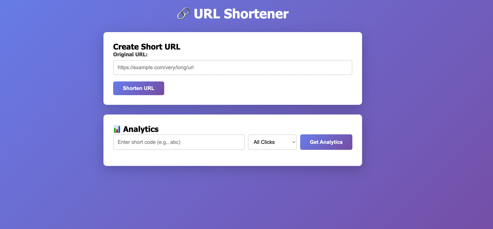

# URL Shortener

Сервис для сокращения URL с аналитикой переходов на базе Go, PostgreSQL и Docker.

## Описание

URL Shortener — это микросервис для создания коротких ссылок (как bit.ly) с возможностью отслеживания аналитики переходов. Сервис использует PostgreSQL для хранения данных, Base62 кодирование для генерации коротких URL и предоставляет удобный веб-интерфейс для управления ссылками.

### Веб-интерфейс



Сервис предоставляет простой и удобный веб-интерфейс для тестирования:
- Создания коротких ссылок
- Тестирования редиректов
- Просмотра аналитики переходов с группировкой

### Основные возможности

- Создание коротких URL с Base62 кодированием (offset 100000 для красивых кодов)
- Автоматический редирект на оригинальный URL (HTTP 302)
- Сбор аналитики: User-Agent, время переходов
- Группировка аналитики по дням, месяцам и User-Agent
- RESTful API для интеграции с другими сервисами
- Веб-интерфейс для управления ссылками
- Структурированное логирование всех операций
- Поддержка миграций базы данных

## Технологический стек

- **Язык**: Go 1.25
- **Веб-фреймворк**: Gin
- **База данных**: PostgreSQL
- **Логирование**: Uber Zap
- **Контейнеризация**: Docker, Docker Compose
- **Миграции**: golang-migrate

## Архитектура

Проект следует принципам Clean Architecture с разделением на слои:

```
Shortener/
├── cmd/                   # Точки входа приложения
│   ├── main.go           # Основное приложение
│   └── migrations/       # Утилита миграций
├── internal/             # Внутренняя бизнес-логика
│   ├── app/             # Инициализация приложения
│   ├── models/          # Модели данных
│   ├── repository/      # Слой работы с БД
│   ├── service/         # Бизнес-логика
│   ├── transport/       # HTTP handlers
│   ├── suberrors/       # Кастомные ошибки
│   └── migrations/      # Логика миграций
├── pkg/                  # Переиспользуемые пакеты
│   ├── logger/          # Настройка логирования
│   ├── postgres/        # Подключение к PostgreSQL
│   └── encode/          # Base62 кодирование
├── web/                  # Веб-интерфейс
│   ├── static/          # Статические файлы
│   └── templates/       # HTML шаблоны
├── migrations/           # SQL миграции
├── docker-compose.yml    # Конфигурация Docker Compose
├── Dockerfile           # Dockerfile для приложения
└── .env                 # Переменные окружения
```

## Требования

- Docker и Docker Compose
- Go 1.25+ (для локальной разработки)

## Установка и запуск

### 1. Клонирование репозитория

```bash
git clone <repository-url>
cd Shortener
```

### 2. Настройка переменных окружения

Создайте файл `.env` в корне проекта:

```env
# PostgreSQL
POSTGRES_USER=root
POSTGRES_PASSWORD=1234
POSTGRES_DBNAME=postgres
POSTGRES_HOST=postgres
POSTGRES_PORT=5432

# Server
HOST=0.0.0.0
PORT=4052
```

### 3. Запуск с помощью Docker Compose

```bash
docker-compose up -d
```

Эта команда запустит следующие сервисы:
- **PostgreSQL** 
- **Shortener Service**

### 4. Проверка работоспособности

После запуска сервисов:

- Веб-интерфейс: http://localhost:4052
- API: http://localhost:4052/api/v1

## API

### Доступные API эндпоинты

| Метод | Путь | Описание |
| :--- | :--- | :--- |
| POST | /api/v1/shorten | Создание короткой ссылки |
| GET | /api/v1/s/:short_url | Редирект по короткой ссылке |
| GET | /api/v1/analytics/:short_url | Получение аналитики |

### Примеры запросов

#### Создание короткой ссылки

```bash
curl -X POST http://localhost:4052/api/v1/shorten \
  -H "Content-Type: application/json" \
  -d '{
    "original_url": "https://www.example.com/very/long/url"
  }'
```

**Ответ:**
```json
{
  "short_url": "q0U",
  "original_url": "https://www.example.com/very/long/url"
}
```

#### Переход по короткой ссылке

```bash
curl -L http://localhost:4052/api/v1/s/q0U
```

**Результат:** HTTP 302 редирект на оригинальный URL

#### Получение аналитики (все клики)

```bash
curl http://localhost:4052/api/v1/analytics/q0U
```

**Ответ:**
```json
{
  "short_url": "q0U",
  "total_clicks": 5,
  "clicks": [
    {
      "id": 1,
      "short_url": "q0U",
      "clicked_at": "2026-03-10T17:00:00Z",
      "user_agent": "Mozilla/5.0 (Windows NT 10.0; Win64; x64) Chrome/120.0"
    }
  ]
}
```

#### Аналитика с группировкой по дням

```bash
curl http://localhost:4052/api/v1/analytics/q0U?group_by=day
```

**Ответ:**
```json
{
  "short_url": "q0U",
  "total_clicks": 150,
  "by_day": [
    {"date": "2026-03-10", "clicks": 50},
    {"date": "2026-03-09", "clicks": 60},
    {"date": "2026-03-08", "clicks": 40}
  ]
}
```

#### Аналитика с группировкой по месяцам

```bash
curl http://localhost:4052/api/v1/analytics/q0U?group_by=month
```

**Ответ:**
```json
{
  "short_url": "q0U",
  "total_clicks": 300,
  "by_month": [
    {"month": "2026-03", "clicks": 150},
    {"month": "2026-02", "clicks": 150}
  ]
}
```

#### Аналитика с группировкой по User-Agent

```bash
curl http://localhost:4052/api/v1/analytics/q0U?group_by=user_agent
```

**Ответ:**
```json
{
  "short_url": "q0U",
  "total_clicks": 150,
  "by_user_agent": [
    {"user_agent": "Chrome/Windows", "clicks": 80},
    {"user_agent": "Safari/iPhone", "clicks": 50},
    {"user_agent": "Firefox/Linux", "clicks": 20}
  ]
}
```

## Структура базы данных

### Таблица `urls`

| Поле | Тип | Описание |
| :--- | :--- | :--- |
| id | SERIAL | Уникальный идентификатор (PRIMARY KEY) |
| short_url | VARCHAR(20) | Короткий код (UNIQUE) |
| original_url | TEXT | Оригинальный URL |
| created_at | TIMESTAMP | Время создания |

### Таблица `clicks`

| Поле | Тип | Описание |
| :--- | :--- | :--- |
| id | SERIAL | Уникальный идентификатор (PRIMARY KEY) |
| short_url | VARCHAR(20) | Ссылка на urls.short_url (FOREIGN KEY) |
| clicked_at | TIMESTAMP | Время клика |
| user_agent | TEXT | User-Agent браузера |

## Миграции базы данных

Миграции применяются автоматически при запуске приложения. Для ручного управления миграциями используйте утилиту:

```bash
# Применить миграции
go run cmd/migrations/main.go up

# Откатить последнюю миграцию
go run cmd/migrations/main.go down

# Откатить все миграции
go run cmd/migrations/main.go reset

# Показать текущую версию
go run cmd/migrations/main.go version
```

Файлы миграций находятся в директории `migrations/`.

### Локальный запуск без Docker

1. Убедитесь, что PostgreSQL запущен и доступен
2. Настройте `.env` файл с корректными хостами
3. Выполните миграции:
   ```bash
   go run cmd/migrations/main.go up
   ```
4. Запустите приложение:
   ```bash
   go run cmd/main.go
   ```

### Структура зависимостей

Основные зависимости проекта:
- `github.com/gin-gonic/gin` - HTTP веб-фреймворк
- `github.com/wb-go/wbf` - фреймворк с утилитами для конфигурации
- `go.uber.org/zap` - структурированное логирование
- `github.com/golang-migrate/migrate/v4` - управление миграциями
- `github.com/lib/pq` - PostgreSQL драйвер

## Как это работает

### Схема архитектуры

```
┌─────────────┐
│   Client    │
│  (Web/API)  │
└──────┬──────┘
       │ POST /api/v1/shorten
       │ {original_url}
       ▼
┌─────────────────────────────────────────────────────────────────┐
│                    Shortener Service                            │
│                                                                 │
│  ┌────────────┐      ┌──────────────┐     ┌──────────────┐      │
│  │  HTTP API  │──1──▶│   Service    │──2─▶│  Repository  │      │
│  │  (Gin)     │      │   Layer      │     │              │      │
│  └────────────┘      │              │     └──────┬───────┘      │
│                      │  ┌────────┐  │            │              │
│                      │  │ Base62 │  │            ▼              │
│                      │  │ Encode │  │     ┌──────────────┐      │
│                      │  └────────┘  │     │  PostgreSQL  │      │
│                      └──────────────┘     │              │      │
│                                           │ ┌──────────┐ │      │
│                                           │ │   urls   │ │      │
│                                           │ │  clicks  │ │      │
│                                           │ └──────────┘ │      │
│                                           └──────────────┘      │
└─────────────────────────────────────────────────────────────────┘
       │
       │ Response: {short_url: "q0U"}
       ▼
┌─────────────┐
│   Client    │
│             │
└──────┬──────┘
       │ GET /api/v1/s/q0U
       ▼
┌─────────────────────────────────────────────────────────────────┐
│                    Shortener Service                            │
│                                                                 │
│  ┌────────────┐      ┌──────────────┐     ┌──────────────┐      │
│  │  HTTP API  │──3──▶│   Service    │──4─▶│  Repository  │      │
│  │  (Gin)     │      │   Layer      │     │              │      │
│  └────────────┘      │              │     └──────┬───────┘      │
│                      │  ┌────────┐  │            │              │
│                      │  │ Click  │  │            ▼              │
│                      │  │ Track  │  │     ┌──────────────┐      │
│                      │  └────────┘  │     │  PostgreSQL  │      │
│                      └──────────────┘     │  INSERT      │      │
│                                           │  click data  │      │
│                                           └──────────────┘      │
└─────────────────────────────────────────────────────────────────┘
       │
       │ HTTP 302 Redirect
       ▼
┌─────────────────┐
│  Original URL   │
└─────────────────┘
```

### Детальный процесс работы

#### Создание короткой ссылки

1. **HTTP запрос**: Клиент отправляет POST запрос на `/api/v1/shorten`:
   ```json
   {
     "original_url": "https://www.example.com/very/long/url"
   }
   ```

2. **Валидация**: Service layer проверяет корректность URL

3. **Сохранение в БД**:
   - INSERT в таблицу `urls` (без `short_url`)
   - PostgreSQL возвращает сгенерированный `id`

4. **Генерация короткого кода**:
   - ID кодируется в Base62 с offset 100000
   - Например: ID=1 → `q0U`, ID=2 → `q0V`

5. **Обновление записи**:
   - UPDATE `short_url` в таблице `urls`

6. **Логирование**: Запись в лог успешного создания

7. **Ответ клиенту**:
   ```json
   {
     "short_url": "q0U",
     "original_url": "https://www.example.com/very/long/url"
   }
   ```

#### Переход по короткой ссылке

1. **HTTP запрос**: GET `/api/v1/s/q0U`

2. **Поиск в БД**:
   - SELECT `original_url` FROM `urls` WHERE `short_url = 'q0U'`

3. **Сохранение клика**:
   - Извлекается User-Agent из заголовка запроса
   - INSERT в таблицу `clicks`:
     - `short_url`
     - `user_agent`
     - `clicked_at` (текущее время)

4. **Логирование**: Запись о редиректе

5. **Редирект**: HTTP 302 на оригинальный URL

#### Получение аналитики

1. **HTTP запрос**: GET `/api/v1/analytics/q0U?group_by=day`

2. **Агрегация в БД**:
   ```sql
   SELECT DATE(clicked_at) as date, COUNT(*) as clicks
   FROM clicks
   WHERE short_url = 'q0U'
   GROUP BY DATE(clicked_at)
   ORDER BY date DESC
   ```

3. **Формирование ответа**:
   ```json
   {
     "short_url": "q0U",
     "total_clicks": 150,
     "by_day": [
       {"date": "2026-03-10", "clicks": 50}
     ]
   }
   ```

### Base62 кодирование

Используется алфавит: `0-9a-zA-Z` (62 символа)

**Примеры:**
- ID 100000 (offset) → `q0U`
- ID 100001 → `q0V`
- ID 100010 → `q14`
- ID 100100 → `qBi`

**Преимущества:**
- Короткие коды (3-4 символа для миллионов записей)
- URL-безопасные символы
- Нет коллизий (ID уникален)

## Мониторинг и отладка

- **Логи**: Сервис использует структурированное логирование Uber Zap
- **Уровни логирования**:
  - `INFO` - успешные операции (создание URL, редиректы)
  - `WARN` - предупреждения (URL не найден, ошибка сохранения клика)
  - `ERROR` - ошибки БД
